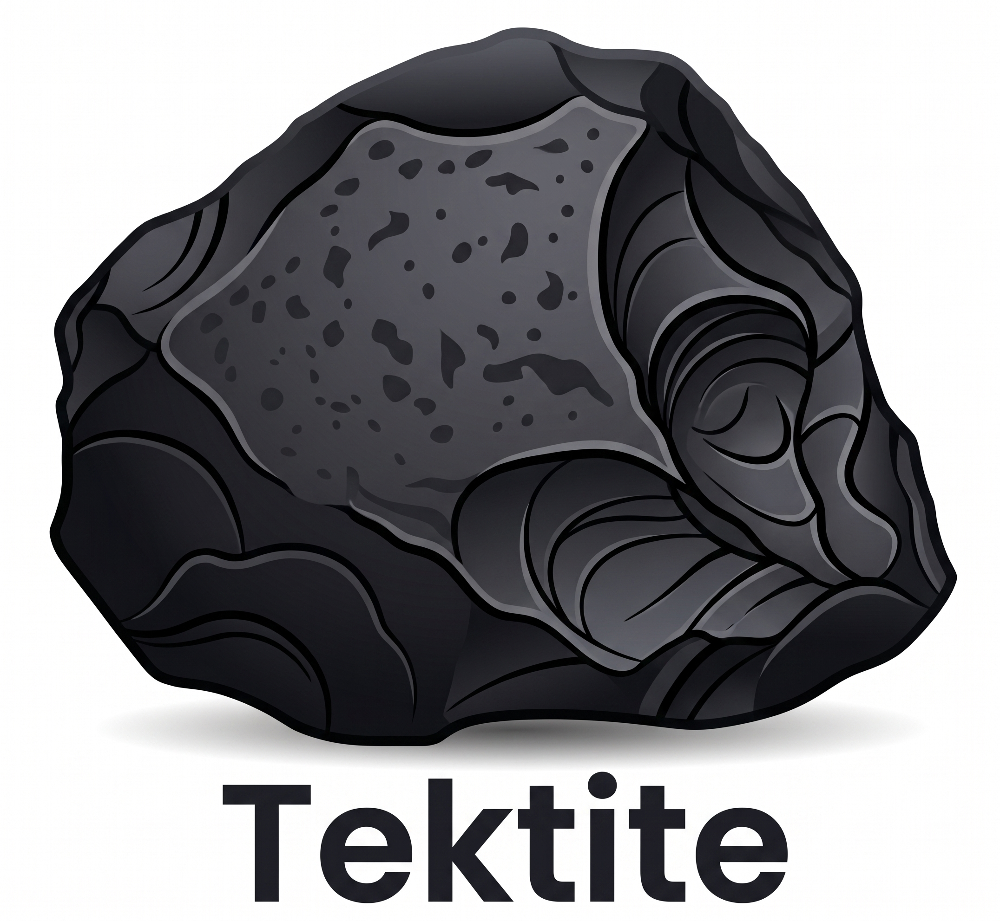
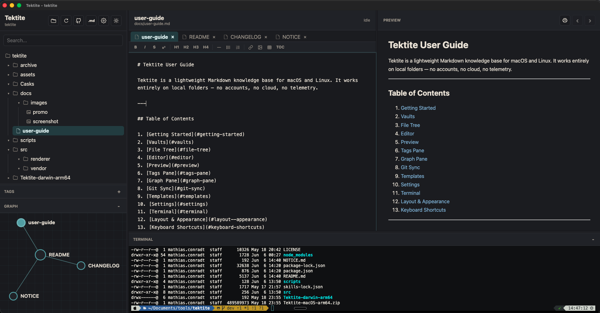

# Tektite

[](https://github.com/mathiasconradt/tektite/actions/workflows/macos-build.yml)
[](https://sonarcloud.io/summary/new_code?id=mathiasconradt_tektite)
[](LICENSE)



Tektite is a local-first Markdown knowledge base app for macOS and Linux. It opens a local folder as a vault, lets you write Markdown notes, shows a live preview, and draws a graph of how notes are connected.

There is no login, cloud sync, telemetry, remote storage, or account system. Your vault is just a folder on disk.

## Features

- Open any local folder as a vault.
- Reopen previously used vaults from `File > Recent Vaults...`.
- Sync Git-backed vaults with a lightweight `git pull --ff-only`, `git add -A`, `git commit`, and `git push` action.
- Browse folders, Markdown notes, and image assets in a collapsible file tree.
- Resize the sidebar, editor, preview, and graph areas.
- Create new notes and folders from the file tree context menu.
- Delete files and folders from the file tree context menu.
- Move files, folders, and images by dragging them in the file tree.
- Automatically update Markdown image references when an image is moved.
- Toggle visible file extensions in the file tree.
- Edit Markdown with autosave.
- Use native-style undo and redo history in the editor.
- Live Markdown preview.
- Click Markdown links and `[[wikilinks]]` in preview to open linked notes.
- Use the Preview back button to return after following a preview link.
- Type `@` in the editor to insert a Markdown link to another note.
- Drag files, folders, or images from the file tree into the editor to insert Markdown links or image embeds.
- Drag images from Finder into the editor or file tree to import and embed them.
- View a graph of note-to-note links.
- Click graph nodes to open notes.
- Zoom the graph with the mouse wheel.
- Pan the graph by dragging empty space.
- Drag individual graph nodes to reposition them.
- Toggle dark and light mode. Dark mode is the default.

## Screenshots



## Run

```sh
npm install
npm start
```

On macOS, `npm start` launches a local packaged `Tektite.app` so the Dock and menu bar show `Tektite` instead of Electron.

For faster development startup, use:

```sh
npm run dev
```

In dev mode on macOS, the host process may still appear as Electron.

## Packaging

```sh
npm run package:mac
npm run package:linux
```

The package scripts use the `electron-packager` CLI provided by `@electron/packager`. Install dependencies first with `npm install`.

## Homebrew

```sh
brew tap mathiasconradt/tektite https://github.com/mathiasconradt/tektite
brew install --cask tektite
```

The cask installs the macOS release asset from GitHub Releases.

Homebrew installs the matching build for Apple Silicon or Intel Macs.

The Homebrew cask removes the macOS quarantine attribute during install. If you download the release zip manually and macOS says the app is damaged, run:

```sh
xattr -cr "/Applications/Tektite.app"
```

Patch releases are created automatically for app changes on `main`. The version bump workflow updates `package.json`, `package-lock.json`, and the Homebrew cask, then pushes a matching `vX.Y.Z` tag. The macOS build workflow publishes that tag as a GitHub Release with the app zip attached.

## Author

Tektite was created by Mathias Conradt.

Copyright © 2026 Mathias Conradt.

Released under the Apache License 2.0.

See [NOTICE.md](NOTICE.md) for third-party notices.
